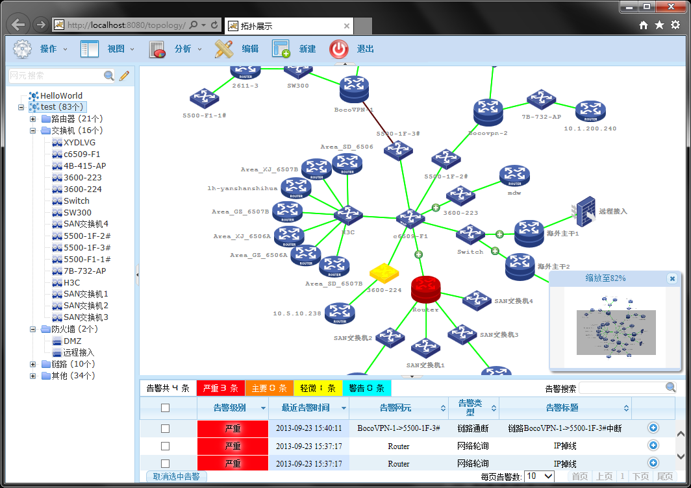
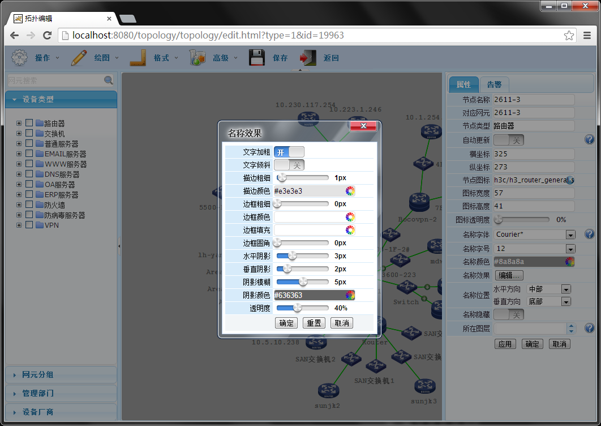

# Topology

[中文版](./README.zh-CN.md)

## Network Topology
Network topologic structure is a diagram that consists of network node equipment and communication medium(from Baidu baike).

## About Project

This solution is a complex html5 graphical system, be used to telecom/enterprise user. Graphical based on SVG, and equips with a series of UI kits, then you can be more intuitive to understand how the project works.  

Topology was developed in 2013, to be clear, the Topology in GitHub is just a **simple example**, or a thin version. The reason: Firstly, I retain the part of rich client only(the Server is secondary); Secondly, the integrated Topology include a lots of graphics solutions(such as BI diagram, virtual private networks, virtualized resources networks in cloud computing, etc.), let's simplify it, and take the focus on the technology.  

## Screenshot

Main Screenshot  
  

Edit Screenshot  
  

Mobile (iOS Safari)  
")

## Online Demo
Resources will be loading after the page open, please be patient. Recommended use Google Chrome to browsing.  
[Online Demo](https://zhaodabao.github.io/topology/main.html?type=1)

## Guide
1. Because there are a lot of files in Topology, suggest to download ZIP(4.9M).
2. Open the main.html file that in the root directory.
3. The view which named ***blank*** allows you to experience the graphical editing.
4. More usage will be added later:)

## Features

- Vectorization, zoom not distortion
- Similar to MS Visio
- WYSIWYG
- Support for export to a PNG or JPG, or export to vectorization PDF(need Java)
- Support shortcuts
- Support eagle eye

## Browser Support

Topology runs best on WebKit based browsers.

BROWSER | DETAIL
------------ | -------------
Google Chrome | 45+, Recommended.
Firefox | 43+
Internet Explorer | 6.0 - 8.0 need to install Adobe SvgViewer; 9.0 is not support filters; 10.0+ partial support transforms, filters, etc; All versions of Internet Explorer is not support SMIL animation. Not recommended.
Opera | 34+
Safari | 9+
iOS Safari | 8.4+
Android Chrome | 47+

## TODO List

- Undo and redo
- Support mobile operation and Responsive UI
- Increase the editional functions of polyline
- Add more graphics rendering, like highlight
- Add Bootstrap style
- Release the source code file
- Let it do more! UML, Flow, etc

## Authors

[@zhaodabao](https://github.com/zhaodabao)  
[@wangzhenhua](https://github.com/wangzhenhua1020)  
[@luqin](https://github.com/luqin)  

## License

Topology is published under the GPL license.
